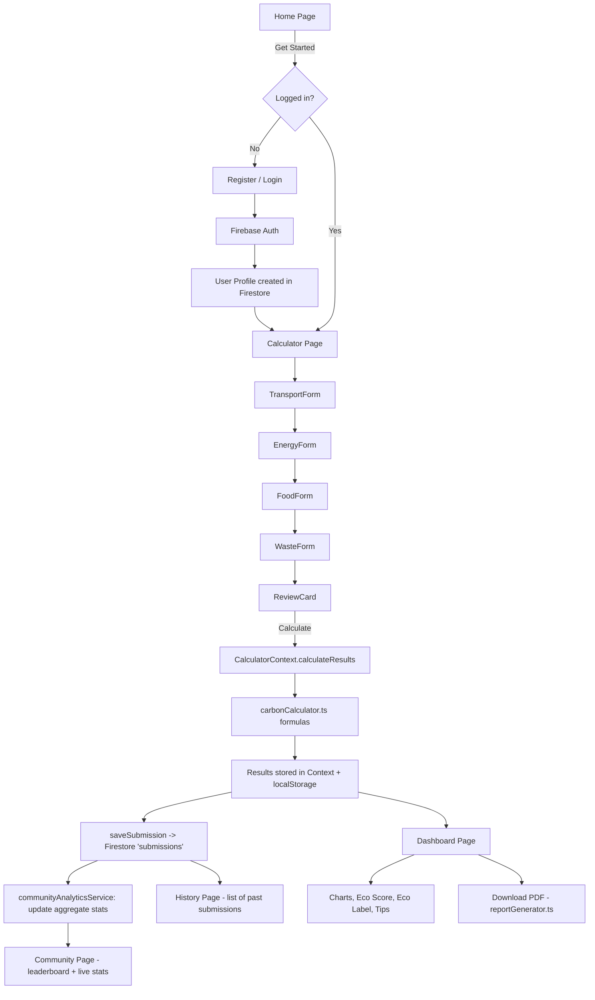
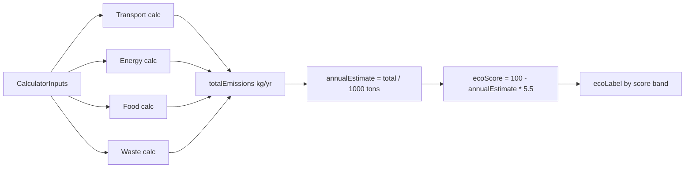
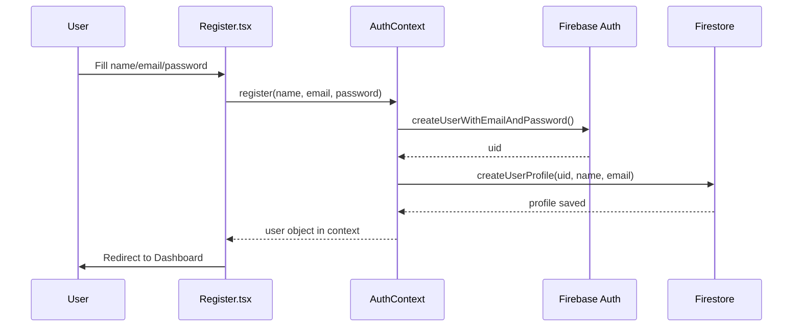
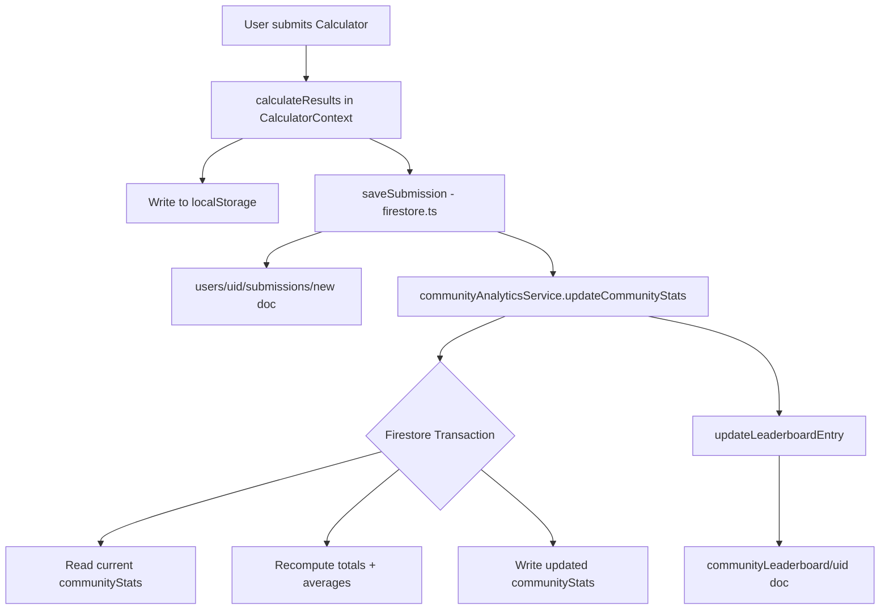

# EcoTrack AI — Project Understanding & Viva Preparation Handbook

> **Purpose of this document:** Get you from zero to confident-in-viva in about one hour. It combines the SEI internship report (the *why*), the README/presentation (the *what*), and the actual source code (the *how*) — and calls out every place where these three disagree.

---

## 1. Project Overview

### 1.1 What is EcoTrack AI?

EcoTrack AI is a React + TypeScript + Firebase web application that lets a user answer a 4-section questionnaire (Transport, Energy, Food, Waste) and instantly get:

- Total daily / annual CO₂ emissions
- An **Eco Score** (0–100) and an **Eco Label** (e.g. "Green Citizen", "High Impact")
- A category-wise breakdown with charts
- Rule-based reduction tips
- A downloadable PDF report
- A community leaderboard and live aggregate statistics

The project began life as a **Societal Engineering Internship (SEI)** — a mandatory 1-credit, 46-hour First Year B.Tech activity at **Pimpri Chinchwad College of Engineering (PCCOE), Pune**, under the Dept. of Applied Sciences & Humanities. It was later carried forward as a **Software Engineering Mini Project**, where the SEI's field research became the seed data and motivation for the web app you see in the repository.

> 📌 **Source note:** The SEI PDF is titled *"EchoTrack"* in its cover page but *"EcoTrack"* everywhere else (including the app). Treat this as a typo in the cover page, not two different projects.

### 1.2 Problem Statement

<blockquote>
Develop an AI-powered, India-specific carbon footprint assessment platform that lets individuals estimate emissions from transport, electricity, food, shopping, and waste — and nudges them toward sustainable habits via personalized recommendations, trends, and gamified incentives.
</blockquote>

Grounded in real findings from the internship:

| Root Cause (from field survey) | Evidence |
|---|---|
| Over-reliance on personal petrol vehicles | 68% of 50 respondents used petrol bike/car |
| High, unmonitored electricity use | 45% ran AC 4+ hrs/day in summer |
| No awareness of diet's carbon impact | 62% non-vegetarian, low awareness |
| No local recycling/composting infra | 78% no segregation, 89% no composting |
| No India-specific, simple tracking tool | 76% had "very low/none" carbon awareness |

### 1.3 Objectives (README + Presentation, merged)

1. Conduct field surveys (5 days, 50+ respondents, 18 questions across 4 categories) to understand real lifestyle emissions.
2. Analyze survey data using India-specific CO₂ emission factors.
3. Design and build **EcoTrack AI**, a web app to calculate, visualize, and track personal carbon emissions.
4. Provide personalized, category-wise reduction tips.
5. Raise awareness of climate change, India's **Net Zero 2070** target, and **UN SDG 13 (Climate Action)**.
6. Gamify the experience with Eco Score, badges, and a community leaderboard.
7. Document 10 detailed case studies validating the app's calculation logic against real-world profiles.

### 1.4 Key Features (as implemented in code)

| # | Feature | Implemented? | Where |
|---|---|---|---|
| 1 | Landing page with quick stats & CTA | ✅ | `pages/Home.tsx` |
| 2 | Email/password registration & login | ✅ | `pages/Register.tsx`, `pages/Login.tsx`, Firebase Auth |
| 3 | 4-step Carbon Calculator (Transport, Energy, Food, Waste) | ✅ | `pages/Calculator.tsx` + `components/calculator/steps/*` |
| 4 | Results Dashboard (charts, eco label, comparisons) | ✅ | `pages/Dashboard.tsx` |
| 5 | Personalized reduction tips | ✅ (rule-based, not ML) | `ImprovementPreview.tsx`, `InsightCard.tsx` |
| 6 | Progress/history tracking | ✅ | `pages/History.tsx`, Firestore `submissions` |
| 7 | Community leaderboard & live stats | ✅ | `pages/Community.tsx`, `communityAnalyticsService.ts` |
| 8 | Downloadable PDF report | ✅ | `utils/reportGenerator.ts` (jsPDF) |
| 9 | Awareness/education module (quizzes, videos) | ❌ Not found in the repository | — |
| 10 | Carbon Pledge / virtual tree planting | ❌ Not found in the repository | — |

> ⚠️ **Discrepancy flag:** The SEI report and PPT list an "Awareness Module" (quizzes, infographics, videos) and a "Carbon Pledge" board with virtual tree planting as planned features. **These are not implemented in the current codebase.** Be ready to say this honestly in viva — it shows you understand scope vs. delivery, which examiners respect far more than pretending everything was built.

### 1.5 Technology Stack (verified from `package.json`)

| Layer | Technology |
|---|---|
| UI Framework | React 19 + TypeScript, Vite 6 build tool |
| Styling | Tailwind CSS 3 |
| Routing | React Router DOM v7 |
| Animation | Framer Motion |
| Charts | Chart.js + react-chartjs-2 |
| Icons | lucide-react |
| Backend-as-a-Service | Firebase 12 (Authentication + Firestore) |
| PDF Generation | jsPDF + jspdf-autotable |
| Testing | Vitest + React Testing Library + jsdom |

> ⚠️ **"AI-powered" claim vs. code reality:** The problem statement, About page, and Register page describe the app as **"AI-powered"** and even claim **"Integrated Gemini AI"**. There is **no AI/LLM SDK in `package.json`** (no `@google/generative-ai`, no OpenAI SDK, no API key config for any LLM) and no network call to any generative AI service anywhere in `src/`. All "AI Insights" and "recommendations" are **deterministic if/else rule logic** written in plain TypeScript. This is covered in depth in [§7](#7-carbon-calculation-engine) and is one of the most likely trap questions — see [§14](#14-trap-questions).

### 1.6 Expected Users

- College students (primary — validated by the survey sample)
- Working professionals / commuters
- Households (measured per-person or per-household in case studies)
- Anyone in India wanting a quick, localized carbon estimate

### 1.7 Societal Impact

- Supports **India's Net Zero 2070** commitment and **UN SDG Goal 13 (Climate Action)**.
- Converts an abstract problem (GHG emissions) into a personal, measurable number — the classic "you can't manage what you don't measure" engineering principle.
- 83% of the 50 surveyed individuals said they would use such a tracking app — validating market/user need.

---

## 2. Application Workflow



### Step-by-step explanation

| Step | What happens | File(s) involved |
|---|---|---|
| **1. Landing** | User sees hero section, quick facts, "Get Started" | `pages/Home.tsx` |
| **2. Auth** | New users register (name, email, password); returning users log in | `pages/Register.tsx`, `pages/Login.tsx`, `firebase/auth.ts` |
| **3. Session bootstrap** | `AuthContext` subscribes to Firebase's `onAuthStateChanged`, loads/creates the user's Firestore profile document | `context/AuthContext.tsx` |
| **4. Calculator** | 4 sequential form steps write into a shared `CalculatorContext` state object (`transportData`, `energyData`, `foodData`, `wasteData`) | `pages/Calculator.tsx`, `components/calculator/steps/*` |
| **5. Review** | User sees a summary of all inputs before submitting | `components/calculator/ReviewCard.tsx` |
| **6. Calculate** | `CalculatorContext.calculateResults()` calls the pure functions in `carbonCalculator.ts`, which use constants in `emissionFactors.ts` | `context/CalculatorContext.tsx`, `utils/carbonCalculator.ts` |
| **7. Persist** | Results are cached to `localStorage` (per-user key) **and** written to Firestore under `users/{uid}/submissions/{id}` | `context/CalculatorContext.tsx`, `firebase/firestore.ts` |
| **8. Aggregate** | A Firestore **transaction** updates community-wide running totals (`communityStats` doc) and the user's leaderboard entry | `services/communityAnalyticsService.ts` |
| **9. Visualize** | Dashboard reads the latest result from context, renders pie/bar charts, Eco Score gauge, category cards, rule-based insights | `pages/Dashboard.tsx` and `components/dashboard/*` |
| **10. Report** | User can download a formatted PDF summary of the same numbers | `utils/reportGenerator.ts` |
| **11. History** | Past submissions are listed by querying the user's `submissions` subcollection | `pages/History.tsx` |
| **12. Community** | Combines the **static SEI survey dataset** with **live Firestore aggregates** into one page | `pages/Community.tsx`, `services/seiDatasetService.ts` |

---

## 3. Architecture

### 3.1 Layered view

```text
┌───────────────────────────────────────────┐
│                Presentation                │   Tailwind CSS, Framer Motion
├───────────────────────────────────────────┤
│                   Pages                    │   Home, Login, Register, Calculator,
│                                             │   Dashboard, History, Community, About
├───────────────────────────────────────────┤
│                 Components                 │   layout/, auth/, calculator/, dashboard/, ui/
├───────────────────────────────────────────┤
│              Context (State)               │   AuthContext, CalculatorContext
├───────────────────────────────────────────┤
│                  Services                  │   communityAnalyticsService, seiDatasetService
├───────────────────────────────────────────┤
│                 Utilities                  │   carbonCalculator, reportGenerator
├───────────────────────────────────────────┤
│              Firebase SDK Layer            │   firebase.ts, auth.ts, firestore.ts
├───────────────────────────────────────────┤
│         Firebase Auth  /  Firestore        │   Cloud backend (BaaS)
└───────────────────────────────────────────┘
```

### 3.2 Why this layering?

| Layer | Reason it exists separately |
|---|---|
| **Pages vs. Components** | Pages = routed screens (own the URL); Components = reusable building blocks used *by* pages. Keeps `App.tsx` routing table thin. |
| **Context** | Two genuinely global concerns — "who is logged in" and "what is the user calculating right now" — are needed by many unrelated components (Navbar, ProtectedRoute, Calculator steps, Dashboard). Context avoids prop-drilling across 4+ component levels. |
| **Services vs. Utilities** | Services talk to **external systems** (Firestore reads/writes, transactions). Utilities are **pure, synchronous functions** (math, PDF layout) with no I/O — easy to unit test in isolation, which is exactly what `carbonCalculator.test.ts` does. |
| **Firebase SDK layer** | `firebase.ts`, `auth.ts`, `firestore.ts` wrap the raw Firebase SDK so the rest of the app never imports `firebase/*` directly — a thin anti-corruption layer. If Firebase were ever swapped for another backend, only this layer changes. |

### 3.3 Data flow in one sentence

**User input → Context state → pure calculation functions → Context result state → simultaneously cached locally and pushed to Firestore → read back by Dashboard/History/Community.**
## 4. Folder Structure

```text
src/
├── components/
│   ├── auth/          → ProtectedRoute, UserMenu
│   ├── calculator/    → step forms, ProgressBar, ReviewCard, NavigationButtons
│   ├── dashboard/      → charts, score badge, insight & equivalent cards
│   ├── layout/         → Navbar, Footer
│   └── ui/              → generic Button, Card, Input, Toast, SectionHeading
├── constants/
│   └── emissionFactors.ts   → all CO₂ factors in one place
├── context/
│   ├── AuthContext.tsx
│   └── CalculatorContext.tsx
├── data/
│   └── seiDataset.ts   → static SEI survey + case-study dataset
├── firebase/
│   ├── firebase.ts     → SDK init
│   ├── auth.ts         → signup/login/logout wrappers
│   └── firestore.ts    → submissions CRUD
├── hooks/
│   └── useCommunityStats.ts   → real-time Firestore listener hook
├── pages/               → one file per route
├── services/
│   ├── communityAnalyticsService.ts   → aggregate stats, leaderboard, transactions
│   └── seiDatasetService.ts            → typed accessor for the static dataset
├── types/
│   └── community.ts     → shared TypeScript interfaces
├── utils/
│   ├── carbonCalculator.ts   → the calculation engine
│   ├── reportGenerator.ts     → PDF export
│   └── *.test.ts                → Vitest unit tests
├── App.tsx               → router + provider tree
└── main.tsx               → React DOM entry point
```

| Folder | Purpose |
|---|---|
| `components/calculator/steps/` | The 4 form screens (Transport, Energy, Food, Waste) — each owns local validation and writes into `CalculatorContext` on submit |
| `components/dashboard/` | Every visual widget on the results screen — kept as small single-responsibility components (`EcoScoreBadge`, `ChartCard`, `CategoryCard`, `EquivalentCard`, `InsightCard`, `ImprovementPreview`) |
| `constants/` | Single source of truth for emission factors — never hardcoded inside components |
| `context/` | Global state accessible via `useAuth()` and `useCalculator()` hooks |
| `data/` | The 50-participant SEI dataset, hand-transcribed into TypeScript so `Community.tsx` can render it without a network call |
| `firebase/` | Thin wrapper layer around the Firebase SDK (see [§3.2](#32-why-this-layering)) |
| `services/` | Business logic that talks to Firestore beyond simple CRUD (aggregation, transactions, leaderboard ranking) |
| `utils/` | Pure, side-effect-free logic — calculation math and PDF drawing |

> Folders like `components/ui/` (Button, Card, Input, Toast) are intentionally **not** detailed further — they are standard presentational wrappers with no domain logic.

---

## 5. Important Files

### `src/App.tsx`
| | |
|---|---|
| **Purpose** | Root component: sets up `BrowserRouter`, wraps the tree in `AuthProvider` then `CalculatorProvider`, defines all routes |
| **Responsibilities** | Route table; wraps `/calculator`, `/dashboard`, `/history` in `ProtectedRoute` |
| **Key structure** | `<AuthProvider><CalculatorProvider><Router>...</Router></CalculatorProvider></AuthProvider>` |
| **Dependencies** | `react-router-dom`, `AuthContext`, `CalculatorContext`, `ProtectedRoute`, all page components |
| **Who uses it** | Entry point — rendered once by `main.tsx` |
| **If removed** | App has no routing; nothing renders |
| **Viva Qs** | *Why is `CalculatorProvider` nested inside `AuthProvider` and not the other way round?* → Because calculation results are tied to a logged-in user's UID; auth state must be known first. |

### `src/main.tsx`
| | |
|---|---|
| **Purpose** | React 19 entry point — mounts `<App />` into `#root` using `createRoot` inside `StrictMode` |
| **If removed** | Nothing renders — this is the actual browser entry file loaded by `index.html` via Vite |

### `src/context/AuthContext.tsx`
| | |
|---|---|
| **Purpose** | Single source of truth for "who is logged in" across the whole app |
| **Responsibilities** | Subscribes to Firebase `onAuthStateChanged`; exposes `user`, `loading`, `login`, `register`, `logout`, `resetPassword` via `useAuth()` hook; loads/creates the matching Firestore user profile document |
| **Key functions** | `login(email, password)`, `register(...)`, `logout()`, `resetPassword(email)` |
| **Dependencies** | `firebase/auth.ts`, `firebase/firestore.ts` |
| **Who uses it** | `Navbar`, `ProtectedRoute`, `Login`, `Register`, `Dashboard` (to know whose data to fetch) |
| **If removed** | No authentication state anywhere — every protected route breaks |
| **Viva Qs** | *How does the app know a user is still logged in after refreshing the page?* → Firebase Auth persists the session in browser storage; `onAuthStateChanged` fires on load and repopulates context. <br>*Is `resetPassword` actually usable from the UI?* → The function exists in context, but the Login page only shows a **non-functional tooltip** for "Forgot password?" — the feature is wired at the logic layer but not exposed in the UI. |

### `src/context/CalculatorContext.tsx`
| | |
|---|---|
| **Purpose** | Holds the in-progress calculator inputs and the most recent calculated result |
| **Responsibilities** | Stores `transportData`, `energyData`, `foodData`, `wasteData`; exposes `calculateResults()` which calls `carbonCalculator.ts`; persists results to `localStorage` (keyed per UID) **and** Firestore; triggers community aggregate update after a successful save |
| **Key functions** | `updateTransportData()`, `updateEnergyData()`, `updateFoodData()`, `updateWasteData()`, `calculateResults()`, `resetCalculator()` |
| **Dependencies** | `utils/carbonCalculator.ts`, `firebase/firestore.ts`, `services/communityAnalyticsService.ts` |
| **Who uses it** | All 4 calculator step forms, `ReviewCard`, `Dashboard`, `History` |
| **If removed** | Calculator steps have nowhere to store data between screens; Dashboard has nothing to display |
| **Viva Qs** | *Why localStorage AND Firestore?* → localStorage gives an instant, offline-friendly re-render on the Dashboard without waiting for a network round trip; Firestore is the durable, cross-device source of truth. |

### `src/utils/carbonCalculator.ts`
The calculation engine — see full breakdown in [§7](#7-carbon-calculation-engine). Used by `CalculatorContext`, tested exhaustively by `carbonCalculator.test.ts`.

### `src/constants/emissionFactors.ts`
Central, typed lookup tables for every emission factor (vehicle type, electricity, LPG, food type, waste). No component or utility hardcodes a raw CO₂ number outside this file — a textbook example of the **single source of truth** principle.

### `src/firebase/firebase.ts`
| | |
|---|---|
| **Purpose** | Initializes the Firebase app once using config from environment variables, exports `auth` and `db` instances |
| **Who uses it** | `firebase/auth.ts`, `firebase/firestore.ts` — nothing else imports Firebase directly |
| **If removed** | Every Firebase call in the app breaks — this is the single initialization point |

### `src/firebase/auth.ts`
Thin wrapper functions (`signUp`, `signIn`, `signOutUser`, `sendPasswordReset`) around Firebase Authentication SDK calls, consumed exclusively by `AuthContext`.

### `src/firebase/firestore.ts`
| | |
|---|---|
| **Purpose** | CRUD operations for user profile documents and the `submissions` subcollection |
| **Key functions** | `createUserProfile()`, `getUserProfile()`, `saveSubmission()`, `getUserSubmissions()` |
| **Who uses it** | `AuthContext` (profile), `CalculatorContext` (save results), `History` page (read submissions) |
| **Viva Qs** | *What Firestore data model is used?* → `users/{uid}` document with a `submissions/{submissionId}` **subcollection** — one document per calculation. |

### `src/services/communityAnalyticsService.ts`
| | |
|---|---|
| **Purpose** | Keeps the community-wide leaderboard and aggregate stats correct and consistent even under concurrent writes |
| **Responsibilities** | Uses a Firestore **transaction** to atomically read-modify-write a shared `communityStats` document (total users, total CO₂ tracked, average eco score) whenever a new submission is saved; updates/creates the user's entry in `communityLeaderboard` |
| **Key functions** | `updateCommunityStats(result)`, `updateLeaderboardEntry(uid, result)` |
| **Dependencies** | Firebase Firestore transactions API |
| **Who uses it** | `CalculatorContext` (after every save), `Community` page (reads results), `useCommunityStats` hook |
| **If removed** | Community page would show no live data — only the static SEI dataset |
| **Viva Qs** | *Why a transaction instead of a plain update?* → Multiple users can submit simultaneously; a transaction prevents a lost-update race condition on the shared aggregate counters. |

### `src/hooks/useCommunityStats.ts`
Custom hook wrapping Firestore's `onSnapshot` real-time listener so `Community.tsx` re-renders automatically whenever the shared `communityStats` document changes — no manual polling needed.

### `src/services/seiDatasetService.ts`
Typed accessor functions over the static `data/seiDataset.ts` file (the 50-participant survey + 10 case studies transcribed from the SEI PDF). Provides `getSurveyStats()`, `getCaseStudies()`, `getEmissionDistribution()` used by `Community.tsx` and `About.tsx` to show the historical research alongside live app data.

### `src/utils/reportGenerator.ts`
| | |
|---|---|
| **Purpose** | Builds a downloadable PDF summary of a calculation result using jsPDF + jspdf-autotable |
| **Responsibilities** | Draws header/branding, a category-emissions table, Eco Score card, and the same rule-based tip text shown on the Dashboard |
| **Dependencies** | `jspdf`, `jspdf-autotable`, calculation result object, emission-factor constants |
| **Who uses it** | `Dashboard` page ("Download Report" button) |
| **If removed** | No PDF export — Dashboard would still work, just without that button |
| **Viva Qs** | *Does the PDF call any AI service to write the tips?* → No — it reuses the same static rule-based recommendation strings as the on-screen `InsightCard`. |

---

## 6. Pages

### Home (`pages/Home.tsx`)
| | |
|---|---|
| **Purpose** | Landing/marketing page |
| **Main components** | Hero section, quick stat cards, feature highlights, CTA buttons |
| **Context used** | `AuthContext` (to decide CTA: "Get Started" vs "Go to Dashboard") |
| **Services used** | None (static content + a few illustrative numbers) |
| **Navigation** | → Register/Login (guest) or → Calculator/Dashboard (logged in) |
| **Viva Qs** | *Why show different CTAs?* → Reduces friction: a returning user shouldn't be pushed through registration again. |

### Login (`pages/Login.tsx`)
| | |
|---|---|
| **Purpose** | Email/password authentication |
| **Context used** | `AuthContext.login()` |
| **Important logic** | Form validation, error toast on failure, redirect to Dashboard on success |
| **Note** | "Forgot password?" is a **disabled tooltip only** — not wired to `AuthContext.resetPassword()` |
| **Viva Qs** | *What happens on invalid credentials?* → Firebase throws an auth error, caught and shown via a Toast component. |

### Register (`pages/Register.tsx`)
| | |
|---|---|
| **Purpose** | New account creation |
| **Important logic** | Collects name/email/password, calls `AuthContext.register()`, which both creates the Firebase Auth user **and** a Firestore profile document |
| **Note** | UI copy lists *"Gemini AI recommendations"* as a benefit — **not implemented in code** (see [§1.5](#15-technology-stack-verified-from-packagejson)) |

### Calculator (`pages/Calculator.tsx`)
| | |
|---|---|
| **Purpose** | Multi-step form to collect emission inputs |
| **Main components** | `ProgressBar`, `StepHeader`, `TransportForm` → `EnergyForm` → `FoodForm` → `WasteForm` → `ReviewCard` |
| **Context used** | `CalculatorContext` (read/write step data, trigger `calculateResults()`) |
| **Important logic** | On final submit, shows an **artificial ~1.5s loading delay** (`setTimeout`) branded as "Carbon Intelligence Engine analyzing..." purely for UX polish — the actual math is synchronous and near-instant |
| **Navigation** | → Dashboard after successful calculation |
| **Viva Qs** | *Why the fake delay?* → Purely perceived-performance UX; instant results can feel untrustworthy for a "calculation". |

### Dashboard (`pages/Dashboard.tsx`)
| | |
|---|---|
| **Purpose** | Main results screen |
| **Main components** | `EcoScoreBadge`, `ChartCard` (pie + bar via Chart.js), `CategoryCard` ×4, `EquivalentCard` (trees), `InsightCard`, `ImprovementPreview`, `ActionButtons` (download PDF, recalculate) |
| **Context used** | `CalculatorContext` (latest result), `AuthContext` (uid) |
| **Important logic** | The **"Historical Trend"** line chart is **simulated** — it multiplies the current total by a series of hardcoded factors (e.g. ×1.22, ×1.18, ...) to fabricate a plausible-looking past trend; it is **not** real historical Firestore data |
| **Viva Qs** | *Is the trend chart real user history?* → No — be upfront that it's a simulated illustrative trend, while `History.tsx` shows the real stored submissions. |

### History (`pages/History.tsx`)
| | |
|---|---|
| **Purpose** | Lists the logged-in user's real past submissions |
| **Services used** | `firebase/firestore.ts` → `getUserSubmissions(uid)` |
| **Important logic** | Queries the `submissions` subcollection ordered by timestamp; renders each as a summary card |
| **Viva Qs** | *How is this different from the Dashboard trend chart?* → History is real Firestore data; the Dashboard trend chart is synthetic. |

### Community (`pages/Community.tsx`)
| | |
|---|---|
| **Purpose** | Combines two very different data sources on one page |
| **Data sources** | (1) **Static** SEI survey dataset (50 participants, 10 case studies) via `seiDatasetService.ts`; (2) **Live** aggregate stats via `useCommunityStats` hook (real-time Firestore listener) |
| **Main components** | Live stat cards (users, reports, CO₂ tracked, avg eco score), leaderboard table, SEI case-study cards, emission-distribution charts |
| **Viva Qs** | *Why mix static and live data on the same page?* → The static dataset is the original research validation (credibility/backstory); the live data proves the deployed app is actually being used. |

### About (`pages/About.tsx`)
| | |
|---|---|
| **Purpose** | Project story, team, timeline of features built |
| **Content** | Lists the 3 team members, a feature-by-feature build timeline (including the *"Integrated Gemini AI"* line item — again, marketing text not reflected in code) |
## 7. Carbon Calculation Engine

> This chapter is extracted directly from `src/utils/carbonCalculator.ts` and `src/constants/emissionFactors.ts`. No formula here is guessed — every number is quoted from the code. The file itself is labelled `CALCULATOR_VERSION = 1` and carries comments warning that changing formulas would break historical reports — a sign the developers were thinking about **data migration and versioning**, a good SE talking point.

### 7.0 Overall structure



All four category calculations produce **annual kg CO₂**, which are summed, then converted to **tons** for the Eco Score formula.

---

### 7.1 Transportation

**Formula:**
```
annualCommuteEmissions = distanceTravelled(km/day) × 365 × factor(mode, fuel)
annualFlightEmissions  = flightsPerYear × 500
transportEmissions     = annualCommuteEmissions + annualFlightEmissions
```

**Factor table (kg CO₂/km):**

| Mode | Petrol | Diesel | CNG | Electric |
|---|---|---|---|---|
| Walk / Cycle | 0 | — | — | — |
| Bus | 0.089 (flat, no fuel choice) | | | |
| Train | 0.041 (flat) | | | |
| Bike | 0.11 | 0.11 (fallback) | 0.07 | 0.03 |
| Car | 0.21 | 0.22 | 0.14 | 0.05 |
| Auto | 0.15 | 0.16 | 0.10 | 0.04 |

Flights: flat **500 kg CO₂ per flight per year** (documented in code as "approximate average short/medium haul").

**Worked example** (default inputs: car, petrol, 15 km/day, 0 flights):
```
15 × 365 × 0.21 = 1,149.75 kg CO2/year
+ 0 flights × 500 = 0
transportEmissions = 1,149.75 kg
```

**Assumptions/Limitations:** Fixed per-mode factors regardless of vehicle age/efficiency; no differentiation of city vs highway driving; a single flat flight factor regardless of distance.

---

### 7.2 Energy (Electricity + Cooking + Appliances)

**Formula:**
```
electricityEmissions = value × 12 × (0.82 if "units" mode | 0.12 if "bill"/₹ mode)
cookingEmissions:
   lpg      → 35 × 12                       (1 cylinder/month assumed)
   png      → 1.9 × 25 × 12                 (25 m³/month assumed)
   electric → 0.4 × 365
   biomass  → 5.0 × 365
acEmissions      = acHours × 365 × 1.23   (if AC used; 1.5 kW × 0.82)
heaterEmissions  = heaterHours × 365 × 1.64  (2.0 kW × 0.82)
deviceEmissions  = deviceCount × 365 × 0.05
energyEmissions  = electricity + cooking + ac + heater + devices
```

**Worked example** (150 units/month, LPG, no AC, 1 hr heater, 5 devices):
```
Electricity: 150 × 12 × 0.82 = 1,476.00 kg
Cooking (LPG): 35 × 12       =   420.00 kg
AC (not used)                 =     0.00 kg
Heater: 1 × 365 × 1.64        =   598.60 kg
Devices: 5 × 365 × 0.05       =    91.25 kg
energyEmissions = 2,585.85 kg
```

**Assumptions/Limitations:** LPG hardcoded to exactly 1 cylinder/month regardless of household size; "bill mode" (₹→kg) uses a rough ₹-to-unit conversion (0.12 kg/₹) rather than the actual local tariff slab; AC/heater power ratings are single fixed values (1.5 kW / 2.0 kW), not appliance-specific.

---

### 7.3 Food

**Formula:**
```
base = dietFactor(vegan=2.5 | vegetarian=3.8 | non-veg=5.5)     kg/day
if non-vegetarian:
   base × meatFrequencyMultiplier × beefMuttonFrequencyMultiplier
dailyFood = max(0.5, base×multipliers + foodWasteFactor + localFoodBonus)
foodEmissions = dailyFood × 365
```

**Multiplier tables:**

| Meat frequency | Multiplier | Beef/Mutton frequency | Multiplier |
|---|---|---|---|
| Daily | 1.5 | Daily | 2.0 |
| Weekly | 1.2 | Weekly | 1.5 |
| Occasionally | 1.0 | Occasionally | 1.1 |
| Never | 0.8 | Never | 0.9 |

| Food waste | kg/day | Local food habit | Bonus kg/day |
|---|---|---|---|
| Low | +0.2 | Always | −0.5 |
| Medium | +0.5 | Mostly | −0.3 |
| High | +1.2 | Rarely | 0 |
| | | Never | +0.2 |

**Worked example** (vegetarian, foodWaste=medium, localFood=mostly):
```
base = 3.8 (no meat multiplier applied — diet is vegetarian)
dailyFood = max(0.5, 3.8 + 0.5 - 0.3) = 4.0 kg
foodEmissions = 4.0 × 365 = 1,460 kg
```

**Assumptions/Limitations:** Meat-frequency multipliers are applied on top of a flat "non-vegetarian" base rather than per-protein-type factors from the SEI report (e.g. beef 27 kg/kg, chicken 6.9 kg/kg) — the app's engine and the SEI report's table are methodologically different (see §7.7 discrepancy note below).

---

### 7.4 Waste

**Formula:**
```
base = dailyWasteFactor(low=0.5 | medium=1.2 | high=2.5)
discountMultiplier = 1.0 - 0.2(if segregation) - 0.3(if recycling) - 0.2(if composting)
discountMultiplier = max(0.3, discountMultiplier)     // floor at 30%
clothing = clothesFrequencyFactor(monthly=3.5 | quarterly=1.5 | annually=0.5 | rarely=0.1)
dailyWaste = base × discountMultiplier + clothing
wasteEmissions = dailyWaste × 365
```

**Worked example** (medium waste, segregation=yes, recycling=yes, composting=no, clothes=quarterly):
```
discountMultiplier = 1.0 - 0.2 - 0.3 = 0.5
dailyWaste = 1.2 × 0.5 + 1.5 = 2.1 kg
wasteEmissions = 2.1 × 365 = 766.5 kg
```

**Assumptions/Limitations:** Segregation/recycling/composting discounts are flat percentage reductions, not based on actual diversion-rate data; clothing purchase frequency is used as a proxy for "shopping/consumption" emissions — a simplification, not a lifecycle assessment.

---

### 7.5 Total, Eco Score & Eco Label

```
totalEmissions  = transport + energy + food + waste          (kg CO2/year)
annualEstimate  = round(totalEmissions / 1000, 2)             (tons CO2/year)
ecoScore        = clamp(1, 100, round(100 - annualEstimate × 5.5))
```

**Eco Label bands (by ecoScore):**

| Score range | Label |
|---|---|
| 85–100 | Eco Warrior |
| 70–84 | Conscious Citizen |
| 50–69 | Average Consumer |
| 30–49 | High Impact |
| 1–29 | Carbon Heavy |

**Full worked example** (all defaults combined from §7.1–7.4):
```
transportEmissions = 1,149.75 kg
energyEmissions    = 2,585.85 kg
foodEmissions       = 1,460.00 kg
wasteEmissions       =   766.50 kg
──────────────────────────────────
totalEmissions       = 5,962.10 kg
annualEstimate         = 5.96 tons/year
ecoScore                = 100 - (5.96 × 5.5) = 100 - 32.78 ≈ 67
ecoLabel                 = "Average Consumer" (score 50–69 band)
```

> ✅ This matches the code's own `initialInputs` defaults — you can reproduce this exact example live in the app by opening the calculator without changing any field.

### 7.6 Equivalents & Recommendations (`EquivalentCard.tsx`, `InsightCard.tsx`, `ImprovementPreview.tsx`)

These are **not part of `carbonCalculator.ts`** — they are separate presentational components that post-process the `CalculationResult` object.

**Environmental equivalents** (all simple unit-conversions of `totalEmissions`):

| Equivalent | Formula |
|---|---|
| Trees required to offset | `totalEmissions / 22` (1 mature tree ≈ 22 kg CO₂/yr absorption) |
| Equivalent km driven (petrol car) | `totalEmissions / 0.21` |
| Equivalent grid electricity | `totalEmissions / 0.82` |
| Equivalent smartphone charges | `totalEmissions / 0.008` (8 g CO₂/charge) |

**"AI Carbon Insights"** (`InsightCard.tsx`): Despite the UI label "AI Carbon Insights" with a sparkle icon, this component:
1. Computes each category's % share of `totalEmissions`.
2. Sorts categories descending.
3. Fills a **template string** naming the #1 and #2 contributors, plus a diet-aware food comment.

There is **no model inference, no API call, and no randomness** — it is fully deterministic string templating driven by `if/else` and array `.sort()`.

**Reduction tips** (`ImprovementPreview.tsx`): A static lookup table maps the **highest-emission category** to a pre-written tip and an estimated potential saving percentage (e.g. "Switch 2–3 commute days/week to public transport" for Transport). These closely mirror the "Top Tip" column of the SEI report's case studies — strong evidence the recommendation copy was authored from that original field research, then hardcoded.

### 7.7 Cross-checking against the SEI PDF

| Aspect | SEI PDF (§10.2 table) | Code (`emissionFactors.ts`) | Match? |
|---|---|---|---|
| Petrol car | 0.21 kg/km | 0.21 kg/km | ✅ |
| Petrol bike | 0.11 kg/km | 0.11 kg/km | ✅ |
| CNG vehicle | 0.07 kg/km | Bike-CNG 0.07; Car-CNG 0.14; Auto-CNG 0.10 (code is more granular) | ✅ (superset) |
| Electric vehicle | 0.029 kg/km | Car-electric 0.05; Bike 0.03; Auto 0.04 (code differs) | ⚠️ Different values |
| Bus | 0.089 kg/km | 0.089 kg/km | ✅ |
| Train | 0.041 kg/km | 0.041 kg/km | ✅ |
| Electricity (India grid) | 0.82 kg/kWh | 0.82 kg/kWh | ✅ |
| LPG cylinder | 35 kg/cylinder | 35 kg/cylinder | ✅ |
| Beef (per kg) | 27 kg CO₂/kg | Not modeled as per-kg meat factor — food uses a flat diet-based daily factor + frequency multipliers | ⚠️ Different methodology |
| Chicken (per kg) | 6.9 kg CO₂/kg | Same as above | ⚠️ Different methodology |
| Vegetables (per kg) | 2 kg CO₂/kg | Not directly modeled | ⚠️ Different methodology |

> ⚠️ **Honest conflict callout:** Transport and energy factors are consistent between the SEI report and the shipped code (good traceability). The **food model diverges**: the SEI report proposes a per-kg, per-food-type approach, while the shipped app uses a simpler flat "diet type × frequency multiplier" approach. Per the review rules, code is trusted for what the app *actually does*; the PDF is trusted for describing the *original research intent*. This is a legitimate, explainable evolution from prototype formula to shipped formula — say so plainly if asked.
## 8. Firebase & Data Flow

### 8.1 Authentication



### 8.2 Firestore data model (as used by the code)

```text
users (collection)
 └── {uid} (document)
      ├── name, email, createdAt
      └── submissions (subcollection)
           └── {submissionId} (document)
                ├── inputs (CalculatorInputs snapshot)
                ├── result (CalculationResult snapshot)
                └── timestamp

communityStats (document, single shared doc)
 ├── totalUsers
 ├── totalReports
 ├── totalCO2Tracked
 └── averageEcoScore

communityLeaderboard (collection)
 └── {uid} (document)
      ├── name (display)
      ├── ecoScore
      └── annualEmissions
```

### 8.3 Save + Aggregate flow



### 8.4 Why a transaction and not a simple `updateDoc`?

If two users submit calculations at almost the same moment, two independent `updateDoc` calls could both read the *old* `totalUsers` count and both write `oldCount + 1`, silently losing one increment (a classic **lost update** race condition). A Firestore **transaction** re-reads the document at commit time and retries automatically on conflict, guaranteeing the aggregate stays correct under concurrent writes.

### 8.5 Local Storage vs Firestore

| | localStorage | Firestore |
|---|---|---|
| Scope | This browser only | Cross-device, permanent |
| Speed | Instant | Network round-trip |
| Used for | Instant Dashboard re-render on refresh without waiting on network | Source of truth for History, Community, PDF |
| Keyed by | `uid` (so switching accounts on the same browser doesn't leak data) | Firestore document ID |

### 8.6 Real-time updates (`useCommunityStats`)

`Community.tsx` does **not** poll Firestore. `useCommunityStats.ts` opens an `onSnapshot` listener on the `communityStats` document, so the moment *any* user anywhere submits a calculation, every open Community page updates live — a natural showcase of Firestore's real-time capability.

---

## 9. Software Engineering Decisions

| Decision | Why (in this project's context) |
|---|---|
| **React + TypeScript** | Component reusability across 4 nearly-identical calculator steps and 6+ dashboard widgets; TypeScript's `CalculatorInputs`/`CalculationResult` interfaces catch mismatched field names between the form, the calculator engine, and Firestore documents at compile time — valuable given how many fields flow through the pipeline. |
| **Context API (not Redux)** | Only two genuinely global state slices exist (auth, calculator). Redux's boilerplate (actions, reducers, store) is unjustified overhead for two contexts with a handful of setters. |
| **Firebase (Auth + Firestore)** | A student/mini-project team needs a working backend without provisioning or maintaining servers. Firestore's real-time listeners map directly onto the "live community stats" feature with almost no extra code. |
| **Firestore over a SQL database** | The data is naturally document-shaped (a submission is a self-contained JSON snapshot of inputs+results) rather than relational; no complex joins are needed; a serverless NoSQL store matches the deployment model (static frontend hosting, no backend server to run migrations). |
| **Services vs. Utilities separation** | Services (Firestore I/O) are inherently async and side-effecting, so they're mocked in `communityAnalyticsService.test.ts`. Utilities (`carbonCalculator.ts`) are pure functions, so they're tested with plain input→output assertions in `carbonCalculator.test.ts` — this split makes both layers independently and cheaply testable. |
| **Component architecture (small, single-purpose dashboard widgets)** | `EcoScoreBadge`, `ChartCard`, `CategoryCard`, `EquivalentCard`, `InsightCard`, `ImprovementPreview` are each self-contained and take `results` as a prop — any one can be reordered, hidden, or reused (e.g. in the PDF layout logic) without touching the others. |
| **Vite build tool** | Fast dev server + HMR for a UI-heavy, iteration-driven student project; simpler config than Webpack. |
| **Vitest for testing** | Native Vite integration, Jest-compatible API — no separate test runner config needed. |

---

## 10. Strengths

- **Formulas centralized in one constants file** (`emissionFactors.ts`) — no magic numbers scattered through components.
- **Pure calculation core is fully unit-tested** (`carbonCalculator.test.ts`) — the most business-critical logic in the app has the best test coverage.
- **Clean 3-tier separation**: Firebase SDK wrapper → Services (business logic) → Context (app state) — none of the UI components talk to Firebase directly.
- **Firestore transactions** used correctly where concurrent writes are actually possible (community aggregates), not everywhere blindly.
- **Real-time UI** via `onSnapshot`, not manual polling.
- **Dual-layer persistence** (localStorage + Firestore) balances instant UX with durable cross-device storage.
- **Traceable lineage from field research to code**: emission factors, case-study numbers, and even reduction-tip wording map back to the original SEI survey and case studies — not arbitrary.
- **TypeScript interfaces** (`CalculatorInputs`, `CalculationResult`, types in `types/community.ts`) keep the data contract consistent across forms, context, Firestore, and the PDF generator.
- **Protected routing** cleanly separates public pages (Home, Community, About) from authenticated pages (Calculator, Dashboard, History) via one reusable `ProtectedRoute` wrapper.

---

## 11. Limitations

- **Emission factors are approximations**, not measured, India-average, government-audited values — clearly documented as "prototype assumptions" in code comments (e.g. LPG = exactly 1 cylinder/month).
- **All input is self-reported** by the user — nothing verifies distance travelled, electricity units, or diet honesty (see [§14](#14-trap-questions), "Can users fake data?").
- **No AI/ML model** despite "AI-powered" branding — all "insights" and "recommendations" are static rule-based logic ([§7.6](#76-equivalents--recommendations-equivalentcardtsx-insightcardtsx-improvementpreviewtsx)).
- **Dashboard trend chart is simulated**, not derived from real historical submissions — could mislead a user into thinking it reflects their actual trend.
- **No offline/IoT/smart-meter integration** — energy usage is manually typed in, not measured.
- **Food model methodology differs from the SEI report's own proposed per-kg factors** (see [§7.7](#77-cross-checking-against-the-sei-pdf)).
- **"Forgot password" is not wired up** in the Login UI despite the underlying function existing.
- **Planned Awareness Module and Carbon Pledge/tree-planting features are not implemented** in the current codebase, despite appearing in the SEI report and presentation.
- **Single shared `communityStats` document** is a write hotspot — every submission across all users contends on the same document; fine at student-project scale, but a scalability concern at real scale (see [§14](#14-trap-questions), "How would you scale this?").

---

## 12. Future Scope

Combining README, presentation, and code-level gaps:

| Area | Planned enhancement |
|---|---|
| **Mobile** | Native Android & iOS apps |
| **Real AI** | Actually integrate an LLM (e.g. Gemini) for a genuine AI sustainability coach — closing the current gap between marketing copy and implementation |
| **IoT** | Smart meter integration for real (not self-reported) electricity data |
| **Maps** | Google Maps integration for eco-friendly route suggestions |
| **Enterprise** | Corporate ESG reporting and Smart City integration |
| **Localization** | Multilingual interface (Marathi/Hindi, given the SEI survey's own language-barrier findings) |
| **Awareness content** | Build the quizzes/infographics/video education module described in the SEI report but not yet coded |
| **Gamification** | Implement the Carbon Pledge board and virtual tree-planting tracker described in the SEI report but not yet coded |
| **History-driven trends** | Replace the Dashboard's simulated trend chart with a real chart computed from the user's actual `submissions` history |
| **Scalability** | Shard the single `communityStats` document (e.g. per-region or sharded counters) to remove the write-contention hotspot as user count grows |
## 13. Top Viva Questions

### Easy (1–20)

1. **What does EcoTrack AI do?** → Lets users input lifestyle data across 4 categories and calculates their annual CO₂ footprint, an Eco Score, and reduction tips.
2. **What tech stack is used?** → React 19 + TypeScript, Vite, Tailwind CSS, Firebase (Auth + Firestore), Chart.js, jsPDF.
3. **Why React?** → Component reuse across near-identical form steps and dashboard widgets; large ecosystem for a student team.
4. **Why TypeScript over plain JavaScript?** → Compile-time safety for the many shared data shapes (`CalculatorInputs`, `CalculationResult`) that flow between forms, context, and Firestore.
5. **Why Firebase?** → Serverless backend (Auth + database) with no infrastructure to manage, ideal for a college project timeline.
6. **What are the 4 calculation categories?** → Transportation, Energy, Food, Waste.
7. **What is an Eco Score?** → A 0–100 score computed from annual emissions; higher = lower footprint.
8. **What is an Eco Label?** → A named band (e.g. "Eco Warrior", "Carbon Heavy") derived from the Eco Score.
9. **Where are emission factors stored?** → `src/constants/emissionFactors.ts`, one central file.
10. **What does the Dashboard show?** → Charts, Eco Score, category breakdown, environmental equivalents, and tips.
11. **Can a user download a report?** → Yes, a PDF via `reportGenerator.ts` (jsPDF).
12. **What is the History page for?** → Lists a logged-in user's real past submissions from Firestore.
13. **What is the Community page for?** → Shows a live leaderboard/aggregate stats plus the static SEI survey dataset.
14. **How does routing work?** → React Router v7; protected routes wrapped in `ProtectedRoute`.
15. **What happens if you're not logged in and visit `/dashboard`?** → `ProtectedRoute` redirects you to Login.
16. **What database is used?** → Cloud Firestore (NoSQL, document-based).
17. **How is a user's password stored?** → Never in Firestore — Firebase Authentication manages credentials securely; only profile info (name, email, uid) is stored in Firestore.
18. **What charting library is used?** → Chart.js via `react-chartjs-2`.
19. **What is `CALCULATOR_VERSION` in the code?** → A documentation constant (currently `1`) flagging that formula changes need versioning since historical reports depend on the current formulas.
20. **How many people were surveyed for the SEI research?** → 50+ respondents, with 10 detailed case studies.

### Medium (21–45)

21. **How is transport emission calculated?** → `distance(km/day) × 365 × factor(mode, fuel)` + `flights/year × 500`.
22. **What's the electricity emission factor used?** → 0.82 kg CO₂ per unit (kWh), matching India's grid average as cited in the SEI report.
23. **How does the app handle "bill mode" vs "units mode" for electricity?** → Units mode multiplies kWh × 0.82; bill mode multiplies ₹ amount × 0.12 as an approximate proxy.
24. **How is the food emission calculated?** → Base diet factor (vegan/vegetarian/non-veg) × meat/beef frequency multipliers, plus food-waste and local-food adjustments, × 365.
25. **How is waste emission calculated?** → Base daily waste level × a discount multiplier (segregation/recycling/composting reduce it, floored at 0.3) + clothing-purchase-frequency factor, × 365.
26. **How is the Eco Score formula derived?** → `100 - annualEstimate(tons) × 5.5`, clamped between 1 and 100.
27. **Why clamp the Eco Score between 1 and 100?** → Prevents negative or >100 scores for extreme inputs, keeping the UI meaningful.
28. **Where is state shared across calculator steps?** → `CalculatorContext`, via `updateTransportData`/`updateEnergyData`/etc.
29. **Why is data saved to both localStorage and Firestore?** → localStorage for instant, offline re-render; Firestore for durable, cross-device storage.
30. **How does the app prevent lost updates on the shared community stats document?** → A Firestore transaction reads-modifies-writes atomically.
31. **What is `useCommunityStats` and why is it a custom hook?** → Wraps Firestore's `onSnapshot` real-time listener so `Community.tsx` gets live updates without manual polling; encapsulating it as a hook keeps the component clean.
32. **What does `ProtectedRoute` actually check?** → Whether `AuthContext.user` exists (and waits on `loading`) before rendering children; otherwise redirects to Login.
33. **How does the PDF report get its content?** → It reuses the same `CalculationResult` object and the same rule-based tip text as the Dashboard — no separate data source.
34. **What are the "environmental equivalents" and how are they computed?** → Trees needed (÷22 kg), km driven equivalent (÷0.21), grid electricity equivalent (÷0.82), phone charges equivalent (÷0.008) — all simple unit conversions of total emissions.
35. **Is the "AI Carbon Insights" card powered by a machine learning model?** → No — it's `if/else` and `.sort()` logic over the four category percentages, wrapped in template strings.
36. **What testing framework is used and what's tested?** → Vitest + React Testing Library; `carbonCalculator.test.ts` unit-tests the pure formulas, `communityAnalyticsService.test.ts` tests the aggregate/transaction logic.
37. **How would you add a 5th emission category (e.g. water usage)?** → Add fields to `CalculatorInputs`, a new factor block in `emissionFactors.ts`, a calculation branch in `carbonCalculator.ts`, a new step form component, and bump `CALCULATOR_VERSION`.
38. **What's the difference between `services/` and `utils/` in this codebase?** → Services perform async I/O against Firestore; utilities are pure, synchronous, side-effect-free functions.
39. **How is the SEI survey dataset connected to the live app?** → It's transcribed into `src/data/seiDataset.ts` and served via `seiDatasetService.ts`, displayed alongside (not merged with) live Firestore community stats on the Community page.
40. **What happens technically when a user submits the calculator form?** → `calculateResults()` runs the pure formulas → result stored in context + localStorage → `saveSubmission()` writes to Firestore → `communityAnalyticsService` updates aggregate stats/leaderboard in a transaction.
41. **Why does the Calculator page show an artificial delay before showing results?** → Perceived-performance UX — instant results can feel less trustworthy for something branded as a "calculation."
42. **How does the app differentiate a logged-in vs guest user on the Home page?** → `AuthContext.user` conditionally changes the CTA and Navbar links.
43. **What is stored in a `submissions` subcollection document?** → A snapshot of the `CalculatorInputs` used and the resulting `CalculationResult`, plus a timestamp.
44. **How is the leaderboard ranked?** → By each user's `ecoScore` / `annualEmissions` stored in the `communityLeaderboard` collection, updated on every submission.
45. **What discount does waste segregation, recycling, and composting each give?** → −20%, −30%, −20% respectively, combined multiplicatively but floored so the total discount never exceeds 70%.

### Hard (46–60)

46. **Why is a Firestore transaction necessary here specifically, and where else might one be needed but isn't?** → Necessary for `communityStats` due to concurrent writes from many users; the per-user `submissions` write doesn't need one since it's scoped to a single user's own subcollection.
47. **The Eco Score formula is linear (`100 - annual × 5.5`). What's a limitation of a purely linear scoring function here?** → It can compress differences at the high-consumption end (multiple very-high emitters all clamp to the same score of 1) and doesn't account for the fact that emissions reductions get harder at the margin — a diminishing-returns curve might be more representative. *(Not found in the repository — this is an analytical/design critique question, not documented reasoning.)*
48. **How would you scale this app to millions of users?** → Shard the single `communityStats` document into multiple sub-counters aggregated periodically (Firestore's distributed counter pattern), paginate leaderboard queries, move heavy aggregation to a Cloud Function trigger instead of a client-side transaction on every write, and cache read-heavy community stats.
49. **What's a security concern with the current Firestore data model as described?** → Firestore Security Rules aren't visible in the code you inspected in `src/`; without them, a client could theoretically write arbitrary values to `communityStats` or another user's `submissions` — always verify security rules exist server-side, not just correct client logic. *("Not found in the repository" for actual rules file — none was located under `src/`.)*
50. **Why keep `carbonCalculator.ts` free of any Firebase/React import?** → Keeps it a pure, portable, framework-agnostic module — testable with plain assertions and reusable if the UI framework ever changes.
51. **How does TypeScript's union-typed `CalculatorInputs` (e.g. `'walk' | 'cycle' | 'bus' | ...'`) help prevent bugs?** → It restricts what a form component can ever set, and the compiler flags any code path (like `resolveTransportFactor`) that doesn't handle every possible mode.
52. **Explain the exact reason `wasteDiscountMultiplier` is floored at 0.3 rather than allowed to go to 0 or negative.** → Prevents unrealistic zero/negative emissions even for a user who selects every eco-friendly waste option — models a floor of unavoidable baseline waste impact.
53. **If two users submit calculations at literally the same millisecond, walk through what Firestore does.** → Both transactions attempt to read `communityStats`; Firestore detects the write conflict on commit, aborts one transaction, and automatically retries it against the now-updated document, so neither increment is lost.
54. **Why might the developers have chosen NOT to store the average Eco Score directly, but instead compute totals and derive the average?** → *(Design inference)* Storing raw totals (`totalCO2Tracked`, `totalReports`) lets the average be recomputed correctly on every new submission without accumulating rounding drift, and keeps the aggregate document a minimal, append-friendly counter set.
55. **What would break if `emissionFactors.ts` were changed today for existing users?** → All new calculations would reflect new formulas immediately, but old stored `submissions` (and the SEI dataset) would remain calculated under the old assumptions — creating an inconsistency the code's own comments explicitly warn about (`CALCULATOR_VERSION`).
56. **Why does `resolveTransportFactor` special-case walk/cycle before checking fuel type?** → Walking and cycling have no fuel input at all (0 kg CO₂/km flat), so fuel-type logic would be meaningless/undefined for those modes — an early return avoids an invalid lookup.
57. **The Dashboard's trend chart fabricates historical points by multiplying the current total by hardcoded factors. What's the risk of shipping this to real users?** → It could be mistaken for genuine historical tracking, undermining user trust once discovered — a strong argument for either clearly labeling it "illustrative" or replacing it with real `submissions` history.
58. **How is the "About" page's claim of "Integrated Gemini AI" a governance/documentation risk, independent of the feature itself?** → It creates a mismatch between what stakeholders (evaluators, users) believe the system does and what it actually does — a documentation/marketing accuracy issue distinct from a technical one.
59. **If you had to add real AI (e.g. Gemini) to generate the "insights," what would change architecturally?** → `InsightCard` would need to become async (loading state), a new service (e.g. `aiInsightService.ts`) would call an LLM API with the `CalculationResult` as context, API keys would need secure server-side handling (not client-exposed), and a fallback to the current rule-based text would be wise for reliability/cost/latency.
60. **How is the calculation engine kept both correct and easy to extend?** → Pure functions + a single constants file + comprehensive unit tests (`carbonCalculator.test.ts`) mean any new factor or category can be added and immediately verified without touching UI code.

---

## 14. Trap Questions

> These are the "gotcha" questions examiners love. Answer honestly — that's what earns marks here, not defensiveness.

**Q: Where exactly is the AI in this "AI-powered" app?**
A: There isn't a machine-learning model anywhere in the code. "AI Carbon Insights" and personalized "recommendations" are deterministic rule-based logic (sorting emission categories, template strings, lookup tables). The branding ("AI-powered", "Gemini AI") in the README/About/Register pages is aspirational/marketing copy that outpaced the actual implementation.

**Q: Can users fake their data?**
A: Yes — every input (distance, electricity units, diet, waste) is self-reported with no verification, sensor, or bill-upload mechanism. This is a known limitation of any self-report survey-style tool, not unique to this app, but worth acknowledging directly.

**Q: Why trust the emission factors used?**
A: They're reasonable approximations aligned with commonly cited India-context figures (e.g. 0.82 kg CO₂/kWh grid average, matching the SEI report), but they are prototype-level constants, not independently audited or region/season-adjusted values. The code comments themselves call them "prototype assumptions."

**Q: What happens without internet access?**
A: Firebase Auth/Firestore calls will fail (no offline persistence was configured in `firebase.ts`); the calculator's math itself runs entirely client-side and would still compute a result, but it could not save to Firestore or update community stats until connectivity returns. localStorage would still hold the last successful in-browser result.

**Q: Why not SQL instead of Firestore?**
A: The data is naturally document-shaped (one submission = one self-contained JSON snapshot), there are no complex relational joins needed, and Firestore's real-time listeners map directly onto the live community-stats feature — a relational database would need extra polling or triggers to replicate that for no added benefit here.

**Q: Why not MongoDB?**
A: Firebase bundles Auth + a NoSQL database + hosting-friendly SDKs in one product with generous free tier, which matches a time-boxed student project better than self-hosting/managing a MongoDB instance and a separate auth solution.

**Q: Why not Redux?**
A: Only two state slices are truly global (auth, calculator-in-progress). React's built-in Context API handles that without Redux's extra actions/reducers/store boilerplate — Redux would be over-engineering for this scope.

**Q: Why not a Node.js backend?**
A: Firebase already provides the two backend capabilities this app needs (authentication, document database) as managed services, so a custom Node.js server would duplicate functionality without adding value, while increasing hosting/maintenance burden for a student team.

**Q: Can this be commercialized as-is?**
A: Not without addressing the current gaps: real emission-factor validation/certification, genuine AI integration (currently just marketing text), Firestore security rules review, and either removing or clearly rebuilding the unimplemented Awareness/Pledge features that are already advertised.

**Q: What happens if Firebase goes down or the project's Firebase quota is exceeded?**
A: Login, registration, saving submissions, and community stats would all fail since they depend entirely on Firebase; the app has no fallback backend. The calculator's math itself is client-side and unaffected, but nothing could persist.

**Q: How accurate are the calculations, really?**
A: They are directionally reasonable estimates for relative comparison (which category dominates your footprint) rather than scientifically precise measurements — the same honest caveat any consumer carbon calculator carries. The SEI report's own case studies were built using this same level of approximation.

**Q: Does the historical trend graph on the Dashboard show my real emissions over time?**
A: No — it's a simulated line generated by multiplying your current total by a few hardcoded factors, purely for visual effect. Your *real* history is on the History page, sourced from actual Firestore submissions.

---

## 15. Five-Minute Revision Sheet

**One-liner:** EcoTrack AI is a React + TypeScript + Firebase app that turns a 4-category lifestyle questionnaire into a CO₂ estimate, Eco Score, and rule-based tips — built on top of a real 50-respondent SEI field survey at PCCOE.

**Architecture (top→bottom):** Pages → Components → Context (Auth, Calculator) → Services (community analytics, SEI dataset) → Utilities (carbonCalculator, reportGenerator) → Firebase wrapper → Firebase Auth/Firestore.

**Workflow:** Home → Register/Login → Calculator (4 steps: Transport→Energy→Food→Waste) → Review → Calculate → save to localStorage + Firestore → update community stats (transaction) → Dashboard / History / Community.

**Calculation core (memorize the shape, not every digit):**
- Transport = km/day × 365 × mode/fuel factor + flights × 500
- Energy = electricity(units×12×0.82) + cooking + AC + heater + devices
- Food = (diet base × meat/beef multipliers) + waste/local adjustments, ×365
- Waste = (base level × segregation/recycling/composting discount, floored at 0.3) + clothing factor, ×365
- Eco Score = `100 − (totalTons × 5.5)`, clamped 1–100
- Labels: 85+ Eco Warrior · 70+ Conscious Citizen · 50+ Average Consumer · 30+ High Impact · <30 Carbon Heavy

**Firebase:** Auth (email/password) + Firestore (`users/{uid}/submissions/{id}`, shared `communityStats` doc updated via **transaction**, `communityLeaderboard` collection). Real-time UI via `onSnapshot` in `useCommunityStats`.

**Dashboard:** Eco Score badge, category charts (Chart.js), environmental equivalents (trees/km/kWh/phone charges — all simple division of total emissions), "AI Carbon Insights" (rule-based, NOT ML), reduction tips (static lookup by highest category), PDF export (jsPDF, same data as screen).

**Community page:** Combines **static** SEI dataset (`data/seiDataset.ts`, 50 respondents/10 case studies) with **live** Firestore aggregates — two different data sources on one page, deliberately.

**Key honest caveats (say these confidently, don't hide them):**
1. No real AI/ML — "AI" features are deterministic rule logic.
2. "Gemini AI" mentioned in UI copy but not implemented in code.
3. Dashboard trend chart is simulated, not real history.
4. All input is self-reported/unverified.
5. Awareness Module & Carbon Pledge (from SEI report) are not yet built.
6. Emission factors are documented "prototype assumptions," not audited figures.

**If asked "why" about any tech choice, the underlying answer is almost always:** *small team, limited timeline, only 2 truly global state needs, no backend infra desired, data is naturally document-shaped, not relational.*
