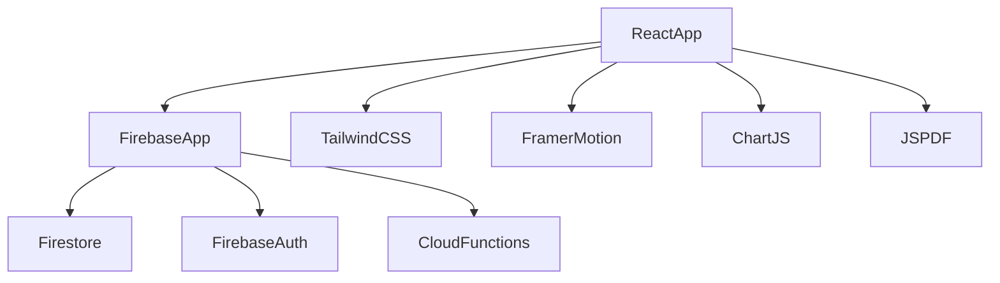

# EcoTrack AI Architecture

This document serves as the memory for future AI agents and developers working on EcoTrack AI.

## Overview
EcoTrack AI is a modern React Single Page Application (SPA) built with Vite, TypeScript, and Tailwind CSS. The backend relies on Firebase (Firestore, Authentication, Cloud Functions).

## Dependency Graph

## Folder Structure
- `/src/components`: Reusable UI components (Buttons, Cards, Inputs).
- `/src/pages`: Top-level route components (`Landing`, `Dashboard`, `Assessment`).
- `/src/pages/*/components`: Feature-specific sub-components to prevent monoliths.
- `/src/context`: React Context providers (`AuthContext`, `CalculatorContext`).
- `/src/services`: API and business logic (`communityAnalyticsService.ts`).
- `/src/utils`: Helper functions (`cn.ts` for class merging).
- `/src/types`: TypeScript interfaces.
- `/functions/src`: Firebase Cloud Functions backend logic.
- `/docs`: Documentation systems (User & AI).

## Data Flow
1. **User Input:** User interacts with UI components.
2. **Context State:** React Context updates locally to drive UI changes instantly.
3. **Service Layer:** `communityAnalyticsService.ts` or `CalculatorContext` communicates with Firebase.
4. **Firestore Write:** Document is saved to `users/{uid}/assessments/{id}`.
5. **Cloud Functions:** Backend triggers `onDocumentCreated` to securely aggregate data into `communityStats`.
6. **Real-time Sync:** `onSnapshot` listeners in the UI receive the updated `communityStats` and trigger a re-render.

## Design Decisions
- **Vite over Create React App (CRA):** For faster build times and better ES module support.
- **Context API over Redux:** The state is relatively localized to specific features (Auth, Assessment). Redux would introduce unnecessary boilerplate.
- **Firebase Backend-as-a-Service:** Rapid iteration and built-in real-time sockets (`onSnapshot`).
- **Tailwind CSS + `cn()` Utility:** Utility-first styling combined with `clsx`/`tailwind-merge` paradigms for clean, dynamic component classes.

## Future Architecture Roadmap
*DO NOT IMPLEMENT THESE YET, THIS IS PREPARATION.*
- **AI Agent Integration:** The system is structured with separated contexts so an AI agent can easily inject state or read the `CalculatorContext` to provide insights.
- **Admin Dashboard:** Firestore rules are configured with Custom Claims (`admin == true`) to allow an external or hidden Admin route to read `communityReports`.
- **Plugin System / Extensions:** The `Assessment` sections are being modularized so future modules (e.g., "Water Usage", "Corporate Supply Chain") can be plugged in without changing the core engine.
